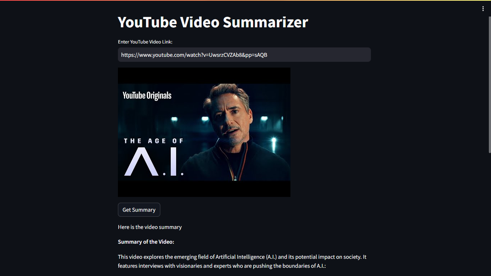

# End To End Youtube Video Transcribe Summarizer LLM App
 -  In this project I have built an end to end YouTube video summarizer LLM app with Google Gemini Pro and Streamlit. The application fetches video transcripts and then summarizes the video using the LLM.
   

## DEMO
 - You can check the project live [here](https://8513-01hwj8ynshjz7spkr595x77ec2.cloudspaces.litng.ai/)

## Description
 - This project showcase the implementation of an end to end YouTube video summarizer LLM app with Google Gemini Pro and Streamlit

## Libraries Used
 - youtube_transcript_api==0.6.2
 - streamlit==1.34.0
 - google-generativeai==0.5.2
 - python-dotenv==1.0.1
 - pathlib==1.0.1

## Installation
 1. Prerequisites
    - Git
    - Command line familiarity
 2. Clone the Repository: `git clone https://github.com/NebeyouMusie/End-to-End-Youtube-Video-Transcribe-Summarizer-LLM-App.git`
 3. Create and Activate Virtual Environment (Recommended)
    - `python -m venv venv`
    - `source venv/bin/activate`
 4. Navigate to the projects directory `cd ./End-to-End-Youtube-Video-Transcribe-Summarizer-LLM-App` using your terminal
 5. Install Libraries: `pip install -r requirements.txt`
 6. run `streamlit run app.py`
 7. open the link displayed in the terminal on your preferred browser

## Usage
1. go to [YouTube](https://www.youtube.com)
2. search for the video you want to summarize
3. right click on the video then click on `copy link`
4. paste the link on the input box of the app then, click on `Enter` to apply
5. you will see the video thumbnail
6. click on `Get Summary`

## Collaboration
- Collaborations are welcomed ❤️

## Acknowledgments
 - I would like to thank [Krish Naik](https://www.youtube.com/@krishnaik06)
   
## Contact
 - LinkedIn: [Nebeyou Musie](https://www.linkedin.com/in/nebeyou-musie)
 - Gmail: nebeyoumusie@gmail.com
 - Telegram: [Nebeyou Musie](https://t.me/NebeyouMusie)

